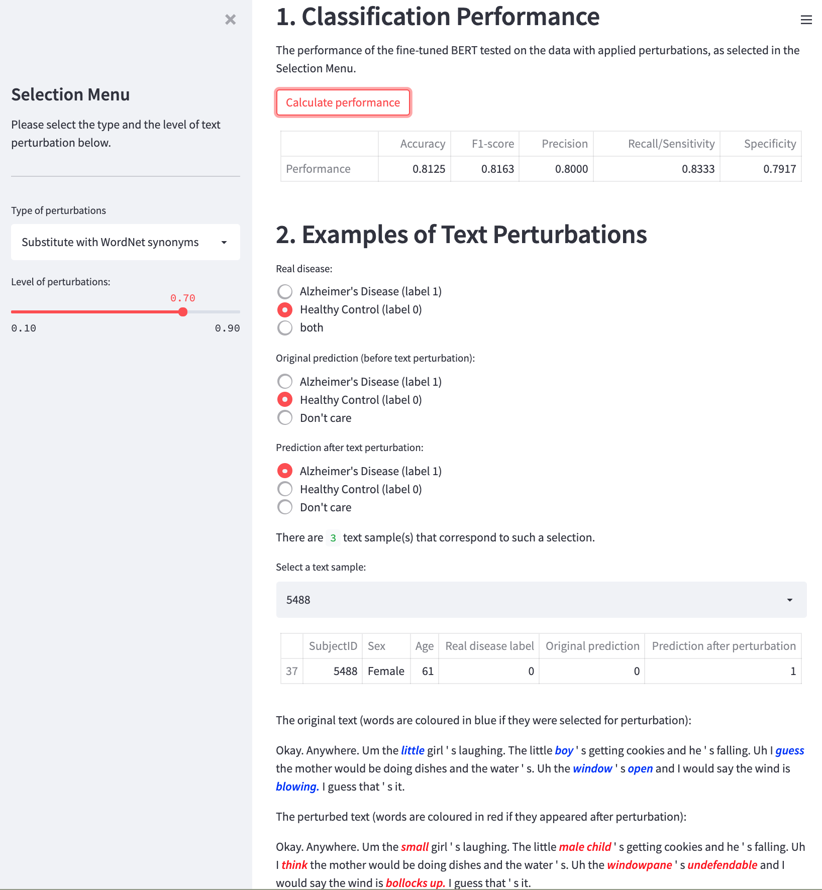

# BERT Robustness Streamlit App

- Streamlit demo app to accompany the following paper: Jekaterina Novikova (2021). [Robustness and Sensitivity of BERT Models Predicting Alzheimer's Disease from Text](https://arxiv.org/abs/2109.11888). *In: The 7th Workshop on Noisy User-generated Text at EMNLP*, 2021.
- Try the demo app [here](https://huggingface.co/spaces/Jekaterina/bert-robustness)

## Install
`pip install -r requirements.txt`

## Run
`streamlit run main.py`
